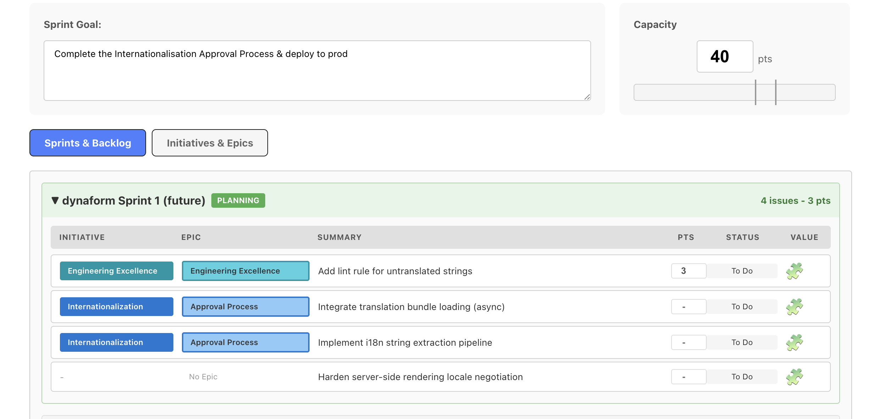
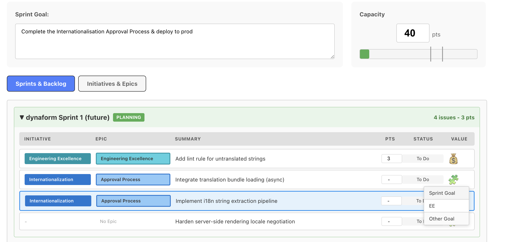
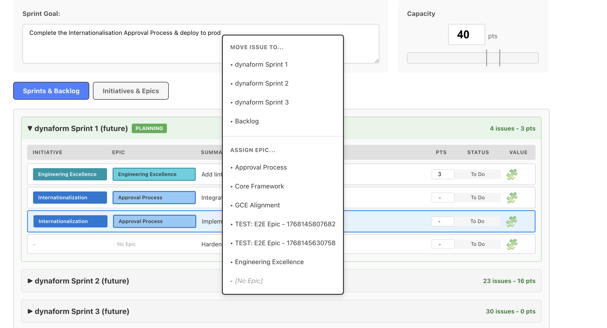
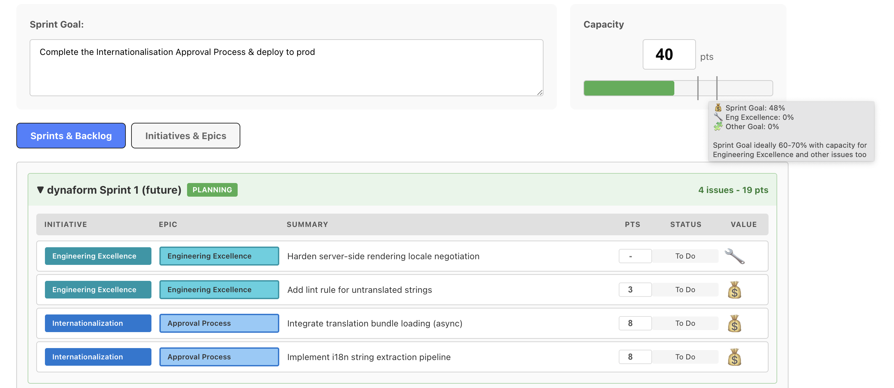
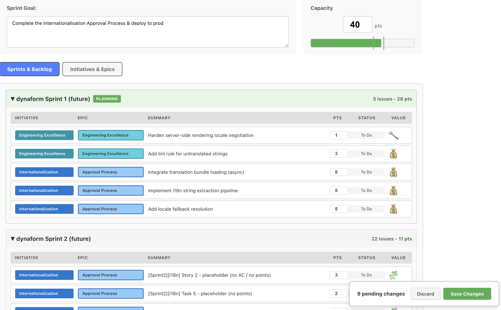

# Jira Sprint Planning Tool

**If your sprint isn’t predominantly focused on its goal, it’s already wrong before you write a line of code.**

**This is a local-first sprint planning UI for Jira that makes sprint goals visible — and planning fast.**

Jira is not optimised for shaping a sprint around a goal.  
It does not make it easy to see whether your sprint actually serves a clear goal.  
And when planning sessions involve constant Jira manipulation, Jira’s performance often gets in the way of real collaboration.

This tool fixes both problems.

Jira Sprint Planner lets you load a snapshot of your backlog locally, plan at full speed, and explicitly categorise work by intent:

- 🎯 **Sprint Goal** – work that directly serves the sprint’s objective  
- 🛠 **Engineering Excellence** – necessary foundational or quality work  
- 📦 **Other** – everything else

As you plan, you get real-time capacity breakdowns showing how much of your sprint is actually aligned to the goal — so you can see when your sprint is “full” but strategically diluted.

## ✨ Features

- **Visual Sprint Planning** - Color-coded categories (💰 Goal, 🔧 Engineering Excellence, 💼 Other) with real-time capacity tracking
- **Bulk Operations** - Multi-select issues (Cmd/Ctrl+Click), assign epics, move between sprints/backlog
- **Auto-Categorization** - Automatic Engineering Excellence work detection via labels, epics, or initiatives
- **Sprint Goal Focus** - Prominent goal display with capacity percentage breakdowns
- **Snapshot-Based** - Load once, plan locally, sync in bulk (no Jira lag during planning)
- **Dynamic Field Discovery** - Portable across different Jira instances and custom fields
- **Conflict Detection** - Safe bulk updates with change conflict resolution

## 📸 Screenshots

### Sprint Planning Workflow

**1. Set Your Sprint Goal**  

*Start every sprint with a clear, measurable goal prominently displayed at the top.*

**2. Load & Categorize Issues**  

*Categorize your issues as Goal, Engineering Excellence, or Other work. The Engineering Excellence category helps track technical debt and infrastructure work that supports the sprint goal.*

**3. Plan & Reorganize**  

*Drag and drop issues between categories. Use bulk operations to move multiple issues at once.*

**4. Monitor Capacity Breakdown**  

*Real-time capacity tracking shows what percentage of your sprint serves the actual goal vs. supporting work.*

**5. Save & Sync to Jira**  

*Bulk sync all changes back to Jira when your sprint plan is ready.*

## 🚀 Quick Start

**Get planning in under 5 minutes:**

```bash
# 1. Clone and install
git clone <repository-url>
cd jira-sprint-planner
npm run install:all

# 2. Configure Jira
cp jira.env.example jira.env
# Edit with your Jira credentials

# 3. Start planning
npm run dev
```

**📖 [Complete Installation Guide](docs/INSTALLATION.md)** - Detailed setup, configuration, and troubleshooting

## 📖 Usage

### Start the Application

```bash
# Quick start (both server and client)
npm run dev
# Server: http://localhost:3001
# Client: http://localhost:5173

# Or manually:
# Terminal 1 - Start server (http://localhost:3001)
cd sprint-planner/server && npm start

# Terminal 2 - Start client (http://localhost:5173)
cd sprint-planner/client && npm run dev
```

### Basic Workflow

1. **Open** `http://localhost:5173` in your browser
2. **Select** your Jira board and sprint from the dropdowns
3. **Load** snapshot data (sprints, backlog, initiatives, epics)
4. **Plan** your sprint:
   - Set your sprint goal (prominent at the top)
   - Move issues between columns (💰 Goal, 🔧 Engineering Excellence, 💼 Other)
   - Watch capacity percentages update in real-time
   - Use bulk operations (multi-select, right-click menus)
5. **Save** changes back to Jira in bulk

### Visual Features

- **Color-coded initiatives** with matching epic shades
- **Issue categorization (contributes to goal, engineering excellence or other)** with capacity tracking
- **Sprint goal always visible** during planning
- **Real-time percentage breakdowns** (Goal vs EE vs Other work)
- **Interactive capacity tracking** with visual feedback

## ⚙️ Configuration

**Minimal required setup:**

```bash
JIRA_BASE_URL=https://your-domain.atlassian.net
JIRA_EMAIL=your-email@example.com
JIRA_API_TOKEN=your-api-token-here
```

**📖 [Full Configuration Guide](docs/INSTALLATION.md#configuration-options)** - Optional settings, multi-team setup, and advanced features

## 🛠️ Development

### Project Structure

```
jira-assist/
├── sprint-planner/
│   ├── client/          # React + Vite frontend
│   ├── server/          # Express API + Jira integration
│   └── .data/           # Local JSON snapshots (gitignored)
├── scripts/            # Test data and utility scripts
├── jira/                # Shared Jira API client/config
└── docs/                # All documentation
```

### Tech Stack

**Frontend:**
- React 19 + Vite
- Pure CSS (no framework)
- PropTypes for validation

**Backend:**
- Node.js 22 + Express
- Jira REST API v3 + Agile API
- Local JSON snapshots
- Structured logging

### Development Commands

```bash
# Install all dependencies
npm run install:all

# Start development servers
npm run dev

# Run tests
npm test

# Build for production
cd sprint-planner/client && npm run build
```


## 🧪 Tests

```bash
# Run server tests
cd sprint-planner/server
npm test

# Run client tests
cd sprint-planner/client
npm test

# Run specific server test suites
cd sprint-planner/server
npm run test:unit      # Unit tests only
npm run test:integration  # Integration tests
npm run test:e2e       # End-to-end tests
```

- **146 total tests** (72 server + 74 client)
- **Comprehensive coverage** of business logic, utilities, and critical paths
- **System tests** validating end-to-end Jira integration

See [Testing Guide](docs/testing/TESTING.md) for detailed test documentation.

## 🤝 Contributing

This project welcomes contributions! Key areas for improvement:

1. **Persistence layer** - Save changes back to Jira
2. **Drag-and-drop** - Reorder issues, move between sprints
3. **Bulk operations** - Epic assignment, story point estimation
4. **Epic creation** - Create new epics from the planner
5. **Multi-board support** - Plan across multiple boards

See [Installation Guide](docs/INSTALLATION.md) for development setup.

## 📚 Documentation

- **[Installation Guide](docs/INSTALLATION.md)** - Complete setup and configuration
- **[Architecture](docs/ARCHITECTURE.md)** - System design and technical decisions
- **[API Reference](docs/API.md)** - API endpoints and contracts
- **[Testing Guide](docs/testing/TESTING.md)** - Test strategy and execution

## 📄 License

MIT License - see [LICENSE](LICENSE) file for details

## 🙏 Acknowledgments

Built with frustration from slow Jira Cloud planning sessions. Special thanks to the early adopters who provided feedback during development.

